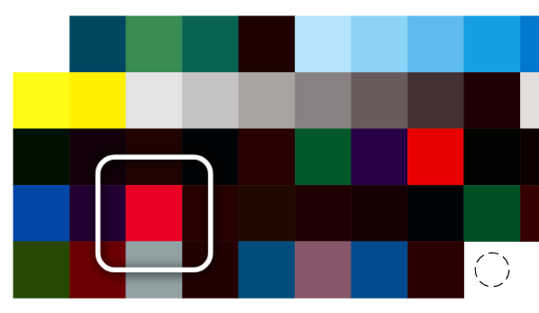

# dabadee



A minimal UI for [bluecolor](https://github.com/virtulis/bluecolor) to assist in quickly[^1] scanning in previously generated color swatches with the [Linshang LS170](https://www.linshangtech.com/product/ls170-colorimeter.html).

[^1]: If one can call ~700 swatches/hour "quick".

See [video of it in action](https://loud.computer/@virtulis/112478210038677684).

## Claimer!

*This software is released with full expectation that no one else will ever need to use it. If you happen to embody a proof to the contrary, please contact me, and I'll happily assist with what goes before and after this to arrive to a working color profile.*

Or you can start by:

1. Installing [bluecolor](https://github.com/virtulis/bluecolor) as instructed there and testing that it works.
2. Installing Node.js and pnpm.
3. Cloning this repo, copying example stuff, building and running:

```sh
git clone https://github.com/virtulis/dabadee.git
cd dabadee
pnpm install
pnpm build
pnpm run server
```

4. Open http://localhost:1752

## Disclaimer!

THE SOFTWARE IS PROVIDED "AS IS", WITHOUT WARRANTY OF ANY KIND, [YADA YADA](./LICENSE).

This project and author are not affiliated with or endorsed by Linshang in any way.

The Ding sound is *Classic Bike Bell Misfire 1* by [manofham](https://freesound.org/s/701045/).
